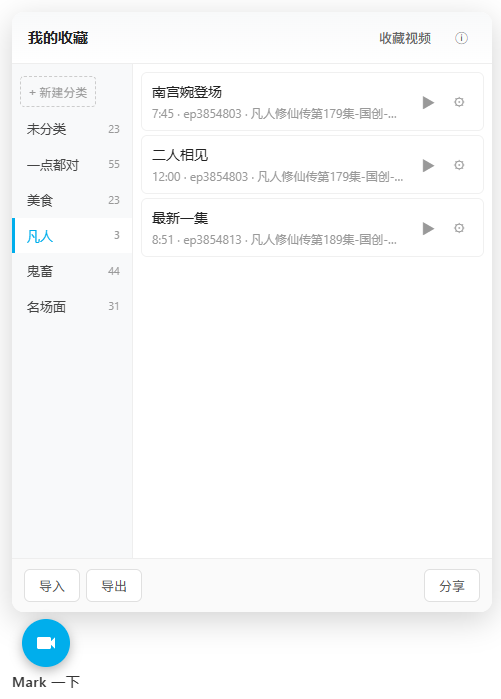

# 油猴脚本：B 站收藏 Mark 一下

您在使用 B 站的时候有没有过这些情况：

- 想要收藏一些梗视频反复欣赏，但每次打开时由于它会记录你上一次看的进度，你还要往回拖一些进度条
- 单个长视频可能含有多个“名场面”，默认的收藏功能不能记录进度条，你不得不在几小时时长的视频中来回拖动进度条确认

那么这个脚本应该非常适合你

## 效果预览

## 安装

1. 安装浏览器扩展 [Tampermonkey](https://www.tampermonkey.net/)(5.x 推荐,4.0+ 也可)
2. 安装脚本:打开 `dist/bilibili-marks.user.js`,Tampermonkey 会自动识别并提示安装

## 特色功能

- 自定义分类，随心收藏
- 精准收藏，空降直达
- 一键生成静态网页，随时分享

## 兼容性

- `@grant none` 模式: 不依赖油猴 GM_* API, 直接用浏览器原生 `localStorage`
- 5MB 存储上限, 能够收藏 25000+ 条视频
- 支持的页面: 首页、视频页、番剧页

## 故障排查

| 现象 | 排查 |
| --- | --- |
| 装上后浮标不出现 | 油猴菜单 → 已安装脚本 → 确认"已启用";@match 覆盖当前页面 |
| 收藏视频按钮灰色 | 当前页面不是 video / bangumi(直播间、其他页都不支持) |
| 数据丢失/没保存 | localStorage 被清;浏览器隐身模式可能不持久 |
| 面板位置/大小异常 | 浏览器缩放比例非 100% 可能影响;改用 100% |

## 隐私

- 所有数据**只存在你浏览器本地**(`localStorage`, key: `bm-store`)
- 脚本不向任何服务器发送你的收藏数据
- "导入"读取本地 JSON 文件, "分享"下载本地 HTML 文件
- 分享 HTML 是 self-contained, 接收者打开时数据已嵌入, 不会再请求你的浏览器

## License

MIT
